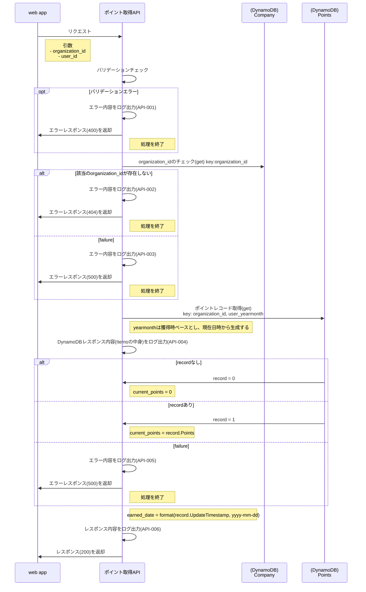

# ログ仕様
| 項番      | 説明                          | ログレベル | 出力例                                                                |
|---------|-----------------------------|-------|--------------------------------------------------------------------|
| API-001 | バリデーションエラー                  | ERROR | API-001 bad request. url: {url}                                    |
| API-002 | 該当の organization_id が見つからない | ERROR | API-002 resource not found. organization_id: {organization_id}     |
| API-003 | DynamoDB アクセスに失敗            | ERROR | API-003 dynamodb request failed. request:{request}, error: {error} |
| API-004 | DynamoDB のレスポンスを出力          | INFO  | API-004 dynamodb response. request:{request}, response: {response} |
| API-005 | DynamoDB のレスポンスを出力          | ERROR  | API-005 dynamodb response. request:{request}, response: {response} |
| API-006 | 成功レスポンス                     | ERROR  | API-006 success api response. response:{response}                  |

ERROR レベルのログは stacktrace も合わせて出力する

