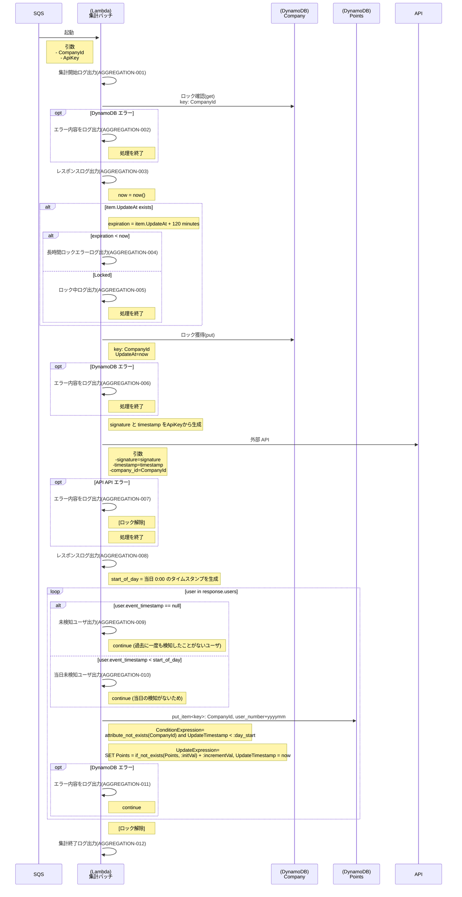
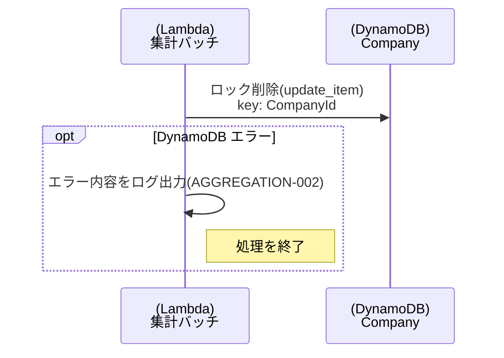

# メインフロー

# ロック解除

# ログ仕様
| 項番             | 説明                              | ログレベル | 出力例                                                      |
|------------------|---------------------------------|-----------|----------------------------------------------------------|
| AGGREGATION-001  | 集計開始ログ                     | Info      | AGGREGATION-001 AGGREGATION Batch start.                  |
| AGGREGATION-002  | DynamoDB アクセス失敗            | Error     | AGGREGATION-002 failed to access DynamoDB. error: {error} |
| AGGREGATION-003  | DynamoDB レスポンス表示           | Info      | AGGREGATION-003 dynamodb response. response: {response}   |
| AGGREGATION-004  | レコードが長期間ロックしているため、ロックを削除する | Error     | AGGREGATION-004 record locked too long. item:{item}       |
| AGGREGATION-005  | レコードがロックされている          | Info      | AGGREGATION-005 locked record. item:{item}                |
| AGGREGATION-006  | DynamoDB アクセス失敗            | Error     | AGGREGATION-006 failed to access DynamoDB. request:{request}, error: {error} |
| AGGREGATION-007  | API API アクセス失敗             | Error     | AGGREGATION-007 failed to access API API. request:{request}, error: {error} |
| AGGREGATION-008  | API API レスポンス                 | Info      | AGGREGATION-008 success API API. request:{request}, error: {error} |
| AGGREGATION-009  | event_timestamp が null           | Info      | AGGREGATION-009 event_timestamp is null. user:{user}      |
| AGGREGATION-010  | event_timestamp が 昨日以前        | Info      | AGGREGATION-010 event_timestamp is older than yesterday. user:{user} |
| AGGREGATION-011  | DynamoDB アクセス失敗            | Error     | AGGREGATION-011 failed to access DynamoDB. request:{request}, error: {error} |
| AGGREGATION-012  | 集計終了ログ                     | Info      | AGGREGATION-012 AGGREGATION Batch end.                    |
| AGGREGATION-999  | 原因不明のエラー                  | Error     | AGGREGATION-999 Unknown error.                            |

ERROR レベルのログは stacktrace も合わせて出力する

